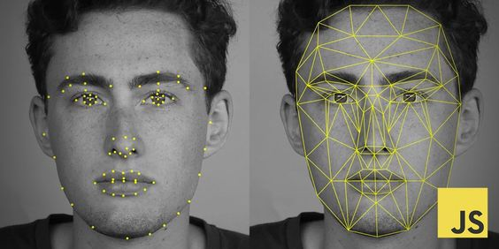
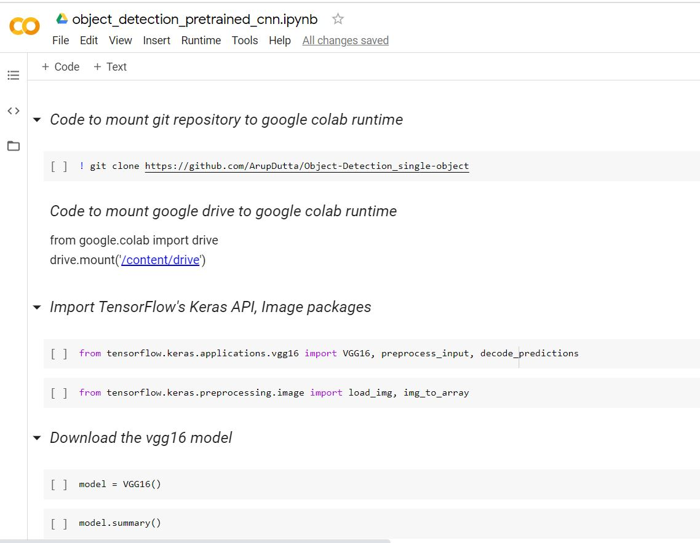
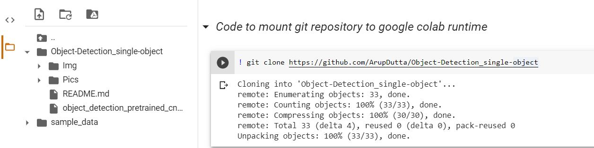
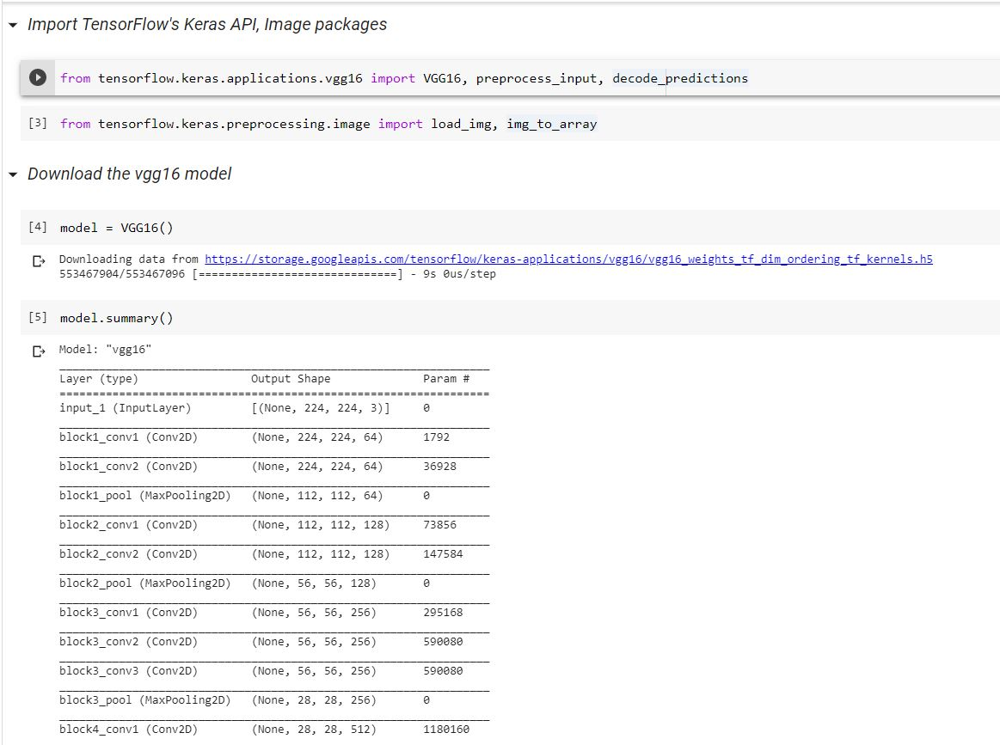
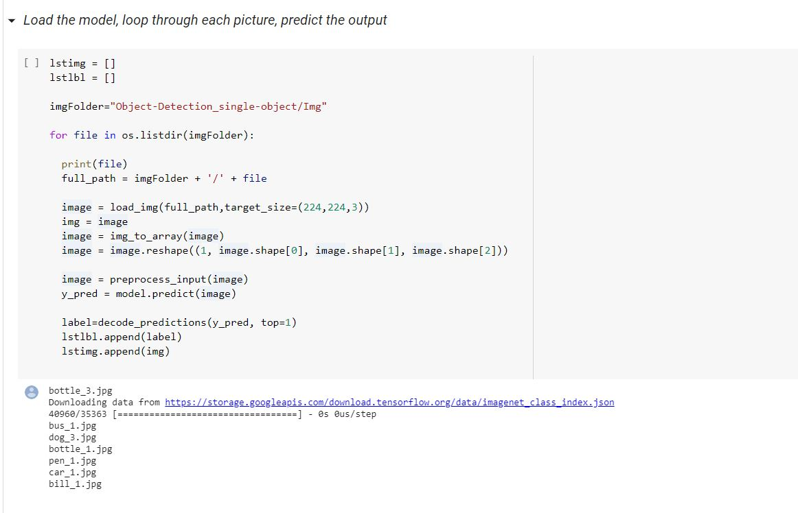

# Image Classification - Classify An Entire Imgae Into One Object And Add A Label To It

## Brief Summary
*Last updated: 02-08-2020 with TensorFlow*

*This repository demonstrate how to create your own object detection model without any complex package/environment installation using google colab. Google colab is an online editor free cloud service comes with GPU, which can be easily used to develop deep learning applications using popular libraries such as Keras, TensorFlow, PyTorch, and OpenCV.*

*Note: This will run in all platform (windows, linux). Make sure to have an google colab account, Its free. Follow [Getting Started with Google Colab](https://www.youtube.com/watch?v=i-HnvsehuSw) to getting started with it.*

  

## Introduction
The sole purpose of this tutorial is to show and explain how easily to create an object detection model using TensorFlow's Keras Application API, without any complex installation to dectect a single object. At the end of the tutorial you will have a model that will detect a specific object in the picture.

If you’re like me, you might be a little hesitant to install Linux on your high-powered gaming PC that has the sweet graphics card you’re using to train a classifier. The Object Detection API is the best option for learning purpose and seems to have been developed on a Linux-based OS.

To set up TensorFlow to train a object detection model on Windows or Linux requires lot of installation and high powered hardware. So, in this tutorial the pre-trained vgg16 classifier model from 'TensorFlow's Keras Application API' is being used to detect the objects in picture. [VGG16 Documentation](https://www.tensorflow.org/api_docs/python/tf/keras/applications/vgg16). Also, this tutorial provides step by step instructions for loading the pre-trained model to detect single object in a picture.

## Steps
### 1. Configure Project
Follow [Anaconda Installation Video](https://www.anaconda.com/distribution/#download-section), which shows the process for installing Anaconda. Visit [TensorFlow's website](https://www.tensorflow.org/api_docs/python/tf/keras), [Keras Website](https://keras.io/api/applications/) for personal studies.

Download the [object_detection_pretrained_cnn.ipynb](https://github.com/ArupDutta/Image-Classifications/blob/master/object_detection_pretrained_cnn.ipynb) file from repository, upload it to your google colab and you are good to go with your Project Configuration.

At this point, here is what *object detection* folder should look like:

  

### 2. Clone Object Detection Repository from GitHub
Once the object_detection_pretrained_cnn.ipynb file is opened execute the code block step by step carefully.

First code block clone the full [TensorFlow object detection repository](https://github.com/ArupDutta/Image-Classifications) to your current runtime from GitHub.

  

### 3. Import Libraries from vgg16, image Module
Import "VGG16", "preprocess_input", "decode_predictions" libraries from *TensorFlow's Keras vgg16* mudule.
  #### a. [VGG16 module](https://www.tensorflow.org/api_docs/python/tf/keras/applications/vgg16) downloads the pre-trained *Deep Convolutional Networks* for Large-Scale Image     Recognition
  #### b. [preprocess_input](https://www.tensorflow.org/api_docs/python/tf/keras/applications/vgg16/preprocess_input) decodes images in batch
  #### c. [decode_predictions](https://www.tensorflow.org/api_docs/python/tf/keras/applications/vgg16/decode_predictions) decodes the prediction of an ImageNet model 

Import "load_img", "img_to_array" libraries from *TensorFlow's Keras Image Preprocessing* mudule.
  #### a. [load_img](https://www.tensorflow.org/api_docs/python/tf/keras/preprocessing/image/load_img) loads image into PIL format
  #### b. [img_to_array](https://www.tensorflow.org/api_docs/python/tf/keras/preprocessing/image/img_to_array) converts a PIL Image instance to a Numpy array

  

### 4. Import OS and Matplotlib Libraries
  #### a. OS library allows to loop through each image in the directory
  #### b. [Matplotlib](https://matplotlib.org/) is a comprehensive library for creating static, animated, and interactive visualizations in Python

### 5. Loop Image Folder - Convert into Numpy Array, Decode, Prediction 

  

### 5. Object Detection Output

  

Happy Learning 👍 

### Connect with me:

